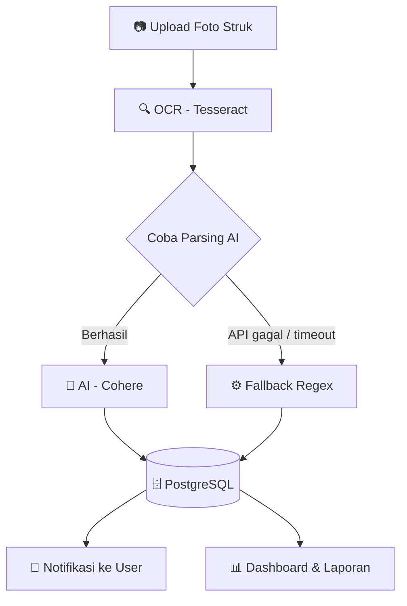
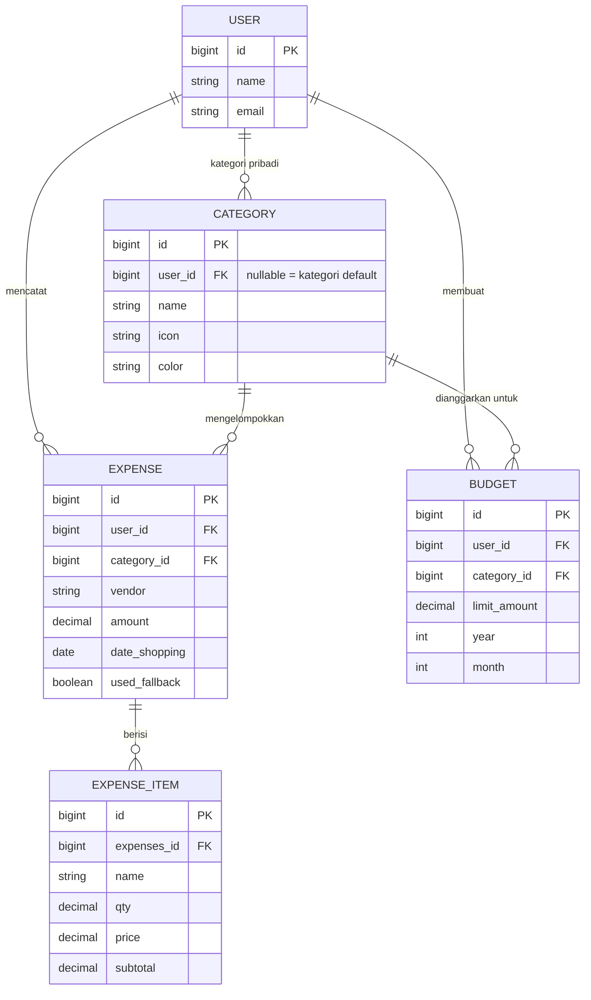

# Catatan Belanja - Aplikasi Pencatat Pengeluaran Berbasis OCR + AI


Aplikasi web untuk mencatat pengeluaran dari foto struk belanja: unggah foto struk, teks dibaca otomatis (OCR Tesseract), lalu di-parsing menjadi data terstruktur (vendor, tanggal, kategori, item, total, kembalian) oleh AI (Cohere) dengan fallback regex bila API gagal. Hasilnya tersimpan di PostgreSQL dan dikelola lewat panel admin Filament.

Dibangun untuk dua segmen: **personal** (catatan harian) dan **UMKM** (multi-user, kategori pengeluaran usaha).

## 🚀 Fitur

- **Upload struk + OCR** - Tesseract OCR (bahasa Indonesia + Inggris), kompresi gambar otomatis (GD) sebelum diproses.
- **Parsing AI + fallback** - Cohere mengubah teks OCR menjadi JSON terstruktur; bila API gagal atau tidak ada key, parser regex bawaan mengambil alih otomatis. Jalur parsing (AI / estimasi) tampil di halaman detail.
- **Panel admin Filament v4** - CRUD Expenses (beserta item belanja), Categories, dan Budgets; preview foto, badge status parsing, polling otomatis hasil parsing, tombol "Proses Ulang OCR & AI".
- **Kategori** - kategori default sistem (dipakai bersama semua user, read-only) + kategori pribadi per user; tebakan kategori otomatis dari vendor/item.
- **Budget bulanan + notifikasi** - anggaran per kategori atau umum per bulan; notifikasi otomatis saat pemakaian menyentuh 90% dan 100% (masing-masing sekali per periode) lewat lonceng notifikasi database Filament.
- **Halaman Laporan** - filter rentang tanggal / bulan + multi-kategori, ringkasan, grafik kategori, export **Excel (.xlsx)** dan **PDF**.
- **Dashboard** - statistik total/jumlah/rata-rata + grafik garis riwayat pengeluaran.
- **Multi-user** - setiap user hanya melihat data miliknya (global scope `OwnedByUserScope`).
- **Notifikasi parsing** - hasil parsing (sukses / estimasi / gagal-total) dikirim ke database notification berisi link "Periksa & Edit".
- **Peringatan antrian** - dashboard memperingatkan bila job parsing macet (queue worker tidak jalan).

## Cara Kerja



## 🛠️ Tech Stack

- Laravel 12 (PHP ^8.2)
- Filament v4 (panel admin)
- PostgreSQL
- Tesseract OCR (`thiagoalessio/tesseract_ocr`)
- Cohere API (parsing AI) + parser regex fallback
- GD (kompresi / pra-proses gambar)
- `maatwebsite/excel` (export .xlsx), `barryvdh/laravel-dompdf` (export PDF)
- Pest (testing)

## 📋 Requirement

- PHP >= 8.2 dengan ekstensi `pdo_pgsql`, `gd`, `mbstring`
- Composer, Node.js + npm (mensupply `npx concurrently` untuk `composer run dev`)
- PostgreSQL >= 13
- **Tesseract OCR** ter-install di server + language data **`ind` dan `eng`**
  (Windows: installer UB-Mannheim — pastikan mencentang kedua language pack, atau salin `ind.traineddata` & `eng.traineddata` ke `C:\Program Files\Tesseract-OCR\tessdata`; Ubuntu: `apt install tesseract-ocr tesseract-ocr-ind`)
- Cohere API key (opsional - tanpa key, aplikasi tetap jalan memakai parser fallback regex)
- Ekstensi `pcntl` (khusus Linux/Mac, **opsional**) — hanya dibutuhkan slot `logs` pada `composer run dev` (Laravel Pail); di Windows slot ini otomatis dilewati

## 📦 Instalasi

1. Clone repo lalu install dependency:
   ```bash
   git clone <url-repo>
   cd catatan-belanja
   composer install
   npm install && npm run build
   ```
   > `npm install` **wajib** dijalankan meski tidak memakai Vite, karena `composer run dev` memakai `npx concurrently` (berasal dari `npm install`).

2. Salin `.env.example` menjadi `.env`, lalu sesuaikan:
   ```env
   DB_CONNECTION=pgsql
   DB_HOST=127.0.0.1
   DB_PORT=5432
   DB_DATABASE=catatan_belanja
   DB_USERNAME=...
   DB_PASSWORD=...
   COHERE_API_KEY=      # opsional
   APP_DEBUG=false      # WAJIB false di production
   ```
   Kemudian generate app key:
   ```bash
   php artisan key:generate
   ```

3. Migrasi + seed (membuat 1 akun admin dan kategori default):
   ```bash
   php artisan migrate
   php artisan db:seed
   ```

4. Symlink storage (untuk asset publik):
   ```bash
   php artisan storage:link
   ```

## ▶️ Menjalankan Aplikasi

> **PENTING - queue worker wajib berjalan.** Parsing OCR + AI dijalankan async lewat `AIParserJob`. Tanpa worker, hasil parsing tidak akan pernah terisi.

### Cara Utama (Direkomendasikan): Satu Perintah

`composer run dev` menjalankan **semua layanan sekaligus dalam satu terminal** (paralel lewat `npx concurrently`):

| Slot | Proses | Fungsi |
|------|--------|--------|
| `server` | `php artisan serve` | HTTP server di `http://127.0.0.1:8000` |
| `queue` | `php artisan queue:listen --tries=1` | Worker antrian **WAJIB** (memproses OCR/AI parsing) |
| `logs` | `php artisan dev:logs` | Log viewer real-time (meneruskan ke `php artisan pail`) |
| `vite` | `npm run dev` | Asset build hot-reload di `http://localhost:5173` |

```bash
composer run dev
```

- **Windows/Laragon** — langsung jalan. Slot `logs` otomatis menampilkan peringatan bahwa **Pail butuh ekstensi `pcntl`** (tidak tersedia di PHP Windows) lalu berhenti bersih (exit 0) tanpa memengaruhi slot lain.
- **Linux/Mac** — slot `logs` otomatis menjalankan `php artisan pail` bila ekstensi `pcntl` tersedia.
- Tekan `Ctrl+C` untuk menghentikan seluruh layanan sekaligus.

### Cara Manual (Alternatif/Fallback)

Gunakan cara ini bila `composer run dev` gagal di environment tertentu — misalnya **Windows tanpa Node.js** (perintah `npx` tidak ditemukan) atau saat ingin memisahkan proses secara eksplisit di 2-3 terminal.

**Mode A - `QUEUE_CONNECTION=database` (default, disarankan untuk production):**

```bash
php artisan serve           # terminal 1
php artisan queue:work      # terminal 2 - WAJIB, jangan sampai lupa!
npm run dev                 # terminal 3 (opsional, hanya untuk hot-reload asset saat development)
```

Tanpa worker, hasil parsing tidak akan pernah terisi. Dashboard punya pengaman: bila ada job tertahan lebih dari 5 menit, muncul peringatan "Antrian parsing terhambat". Perintah berguna:

```bash
php artisan queue:restart       # restart worker setelah deploy
php artisan queue:failed        # daftar job yang gagal
php artisan queue:retry all     # ulangi job yang gagal
```

**Mode B - `QUEUE_CONNECTION=sync` (tanpa worker, untuk personal / dev):**

Parsing dieksekusi langsung saat upload, jadi tidak perlu worker. Trade-off: request upload menjadi sedikit lebih lama karena menunggu OCR + AI selesai.

> **Catatan untuk slot `logs`/Pail:** `php artisan dev:logs` — command pembungkus di `app/Console/Commands/DevLogs.php` — memanggil `php artisan pail` hanya bila ekstensi `pcntl` tersedia. Di sistem tanpa `pcntl` (Windows/PHP NTS), perintah dilewati dengan aman; pantau log via `storage/logs/laravel.log`.

Panel admin tersedia di **`/admin`** - login dengan akun hasil seed (`test@example.com` / `password`) atau registrasi akun baru (lihat catatan keamanan di bawah).

## 🔄 Upgrade dari Versi Lama (opsional)

Bila memakai versi lama aplikasi (foto struk masih di `storage/app/public/receipts`), pindahkan ke disk privat baru:

```bash
php artisan receipts:move-to-private-disk
```

Command aman dijalankan berulang (idempotent) dan memverifikasi setiap file sebelum menghapus salinan lamanya.

## 🧪 Testing

```bash
php artisan test
```

Test suite (Pest) mencakup scoping multi-user, parsing fallback, budget & notifikasi, halaman Laporan/Export, dan route foto struk.

## 🔐 Catatan Keamanan untuk Pembeli/Developer

- **Authorization via global scope, bukan Policy.** Aplikasi ini tidak memakai Laravel Policy - isolasi data per-user sepenuhnya lewat global scope `OwnedByUserScope` (model Expense & Budget) ditambah override query di resource Category. Kalau menambah endpoint/route baru **di luar Filament**, tambahkan authorization check manual.
- **Registrasi terbuka secara default.** Siapa pun bisa mendaftar lewat halaman registrasi panel. Cara menonaktifkan: hapus/comment baris `->registration(Register::class)` di `app/Providers/Filament/AdminPanelProvider.php`.
- **`OwnedByUserScope` tidak aktif untuk request tanpa auth** (by design, agar queue/console bisa memproses data). Kalau menambah route **publik** yang mem-query model `Expense`/`Budget`/`Category`, WAJIB tambahkan filter `user_id` manual.
- **Set `APP_DEBUG=false` di environment production.** Halaman debug dapat membocorkan stack trace dan isi `.env`.
- **Foto struk disimpan di disk privat** (`receipts` - `storage/app/private/receipts`), BUKAN lagi di `public/storage`. Penyajian hanya lewat route `/receipt-image/{expense}` dengan authorization check (hanya pemilik expense; user lain dan tamu tidak mendapat akses).
- Kredensial apa pun hanya boleh ada di `.env` (tidak pernah di-commit); `.env.example` disediakan bersih sebagai template.

## 📈 Cara Scale Up untuk Banyak User

Konfigurasi bawaan (queue database + 1 worker) sudah lebih dari cukup untuk
personal/UMKM skala kecil. Ketika aplikasi dipakai banyak user yang upload struk
bersamaan, berikut langkah-langkah yang bisa dilakukan:

1. **Ganti queue driver ke Redis dan jalankan beberapa worker paralel.** Default
   `QUEUE_CONNECTION=database` cocok dengan 1 worker, tapi saat banyak user
   upload struk bersamaan, antrean job akan menumpuk. Ganti driver-nya di `.env`:
   ```env
   QUEUE_CONNECTION=redis
   ```
   lalu jalankan beberapa worker paralel — `php artisan queue:work --queue=default`
   bisa dijalankan berkali-kali di proses/terminal terpisah, atau gunakan
   **Supervisor** / **Laravel Horizon** untuk mengelola banyak worker secara otomatis.

2. **Wajar jika widget "Antrian parsing terhambat" muncul.** Satu job parsing
   OCR+AI butuh **15-45 detik** (tergantung respons API Cohere). Widget di
   Dashboard muncul bila ada job tertahan lebih dari **5 menit** — saat lonjakan
   banyak upload bersamaan dengan 1 worker, ini WAJAR terjadi, **bukan
   berarti sistem rusak**. Tambah jumlah worker untuk mengurangi hal ini.

3. **Performa asset di production.** Jalankan `npm run build` (**bukan** `npm run
   dev`) sebelum deploy, dan aktifkan **gzip/brotli compression** di web server
   (Apache/Nginx) agar ukuran CSS Filament dan asset lainnya lebih kecil.

4. **(Opsional — catatan saja, belum perlu diimplementasikan sekarang):** bila
   nanti data sudah sangat besar (ribuan baris per user), dashboard bisa di-cache
   per user untuk meringankan beban query.

## 🗂️ Struktur Penting



```
app/Filament/Resources/     Resource admin panel (Expenses, Categories, Budgets)
app/Services/               OCRService, AIParserService, Helper, BudgetAlertService, ImageCompressor
app/Jobs/AIParserJob.php    Job parsing async (teks OCR -> AI/fallback -> database)
app/Support/                MoneyFormatter, ReportFilter
app/Models/Scopes/          OwnedByUserScope (isolasi data per-user)
app/Console/Commands/       expenses:reprocess, expenses:assign-default-category,
                            receipts:move-to-private-disk
```

## 📄 Lisensi

MIT - bebas digunakan dan dimodifikasi untuk project pribadi maupun klien.
