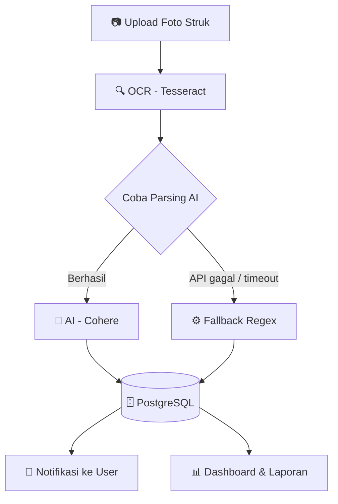
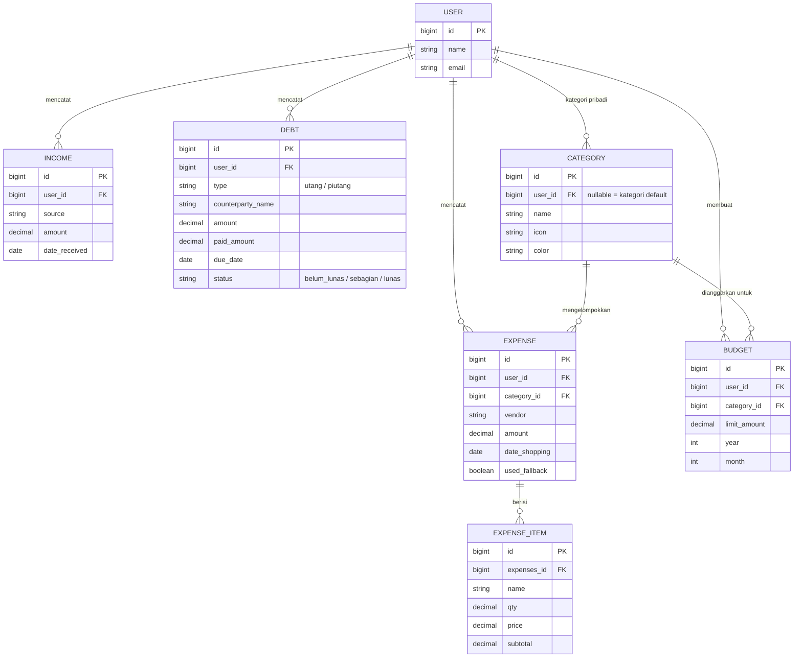

# Catatan Belanja - Aplikasi Pencatat Keuangan Berbasis OCR + AI


Aplikasi web untuk mencatat **keuangan secara lengkap** - bukan hanya pengeluaran. Unggah foto struk belanja: teks dibaca otomatis (OCR Tesseract), lalu di-parsing menjadi data terstruktur (vendor, tanggal, kategori, item, total, kembalian) oleh AI (Cohere) dengan fallback regex bila API gagal. Selain pengeluaran, aplikasi ini juga mencatat **pemasukan (income)**, **utang piutang** beserta status pelunasannya, menyajikan laporan **kas arus** (pemasukan vs pengeluaran), dan menyediakan asisten **Tanya AI** untuk tanya-jawab keuangan. Semua data tersimpan di PostgreSQL dan dikelola lewat panel admin Filament.

Dibangun untuk dua segmen: **personal** (catatan harian) dan **UMKM** (multi-user, kategori pengeluaran usaha).

## 🚀 Fitur

- **Upload struk + OCR** - Tesseract OCR (bahasa Indonesia + Inggris), kompresi gambar otomatis (GD) sebelum diproses.
- **Parsing AI + fallback** - Cohere mengubah teks OCR menjadi JSON terstruktur; bila API gagal atau tidak ada key, parser regex bawaan mengambil alih otomatis. Jalur parsing (AI / estimasi) tampil di halaman detail.
- **Panel admin Filament v4** - CRUD Expenses (beserta item belanja), Incomes, Debts (utang piutang), Categories, dan Budgets; preview foto, badge status parsing, polling otomatis hasil parsing, tombol "Proses Ulang OCR & AI".
- **Pemasukan (Income)** - catat uang masuk (gaji, penjualan, komisi, dsb.) dengan sumber, nominal, tanggal diterima, dan catatan; CRUD penuh di panel plus kartu "Total Pemasukan" di Dashboard.
- **Utang Piutang** - catat utang (uang yang kita pinjam) dan piutang (uang yang kita pinjamkan) dengan nama pihak, nominal, dan jatuh tempo. **Status pelunasan terhitung otomatis** (Belum Lunas / Sebagian / Lunas) dari nominal yang sudah terbayar, plus aksi "Tandai Lunas" & "Catat Pembayaran Sebagian", kartu Total Utang/Piutang Aktif di Dashboard, dan export Excel & PDF.
- **Kategori** - kategori default sistem (dipakai bersama semua user, read-only) + kategori pribadi per user; tebakan kategori otomatis dari vendor/item.
- **Budget bulanan + notifikasi** - anggaran per kategori atau umum per bulan; notifikasi otomatis saat pemakaian menyentuh 90% dan 100% (masing-masing sekali per periode) lewat lonceng notifikasi database Filament.
- **Halaman Laporan** - filter rentang tanggal / bulan + multi-kategori, ringkasan, grafik kategori, export **Excel (.xlsx)** dan **PDF**.
- **Kas Arus** - halaman laporan arus kas: ringkasan **Total Pemasukan**, **Total Pengeluaran**, dan **Saldo**, grafik batang pemasukan vs pengeluaran per bulan, serta tabel breakdown per bulan. Mengikuti filter periode (rentang tanggal / bulan) dengan export **Excel (.xlsx)** dan **PDF**.
- **Dashboard** - statistik total/jumlah/rata-rata + grafik garis riwayat pengeluaran.
- **Multi-user** - setiap user hanya melihat data miliknya (global scope `OwnedByUserScope`).
- **Notifikasi parsing** - hasil parsing (sukses / estimasi / gagal-total) dikirim ke database notification berisi link "Periksa & Edit".
- **Peringatan antrian** - dashboard memperingatkan bila job parsing macet (queue worker tidak jalan). Hitungan hanya mencakup struk milik user yang sedang login.
- **Tanya AI** - tombol aksi di Dashboard untuk bertanya tentang keuangan pakai bahasa natural (contoh: "Berapa total pengeluaran saya?", "Kategori apa paling boros?", "Berapa sisa utang saya?"). Pertanyaan otomatis di-*retrieve* ke data yang relevan - periode, kategori, dan jenis data yang disebut dideteksi dari pertanyaannya - dan cakupannya meliputi **semua jenis data** (pengeluaran, pemasukan, serta utang & piutang). Ringkasan data itu baru dikirim ke Cohere dengan system prompt ketat agar tidak ngarang angka. Rate limit harian configurable lewat `AI_INSIGHT_DAILY_LIMIT` (default 10 pertanyaan/user/hari).

## Cara Kerja


```mermaid
flowchart TD
    A[📷 Upload Foto Struk] --> B[🔍 OCR - Tesseract]
    B --> C{Coba Parsing AI}
    C -->|Berhasil| D[🤖 AI - Cohere]
    C -->|API gagal / timeout| E[⚙️ Fallback Regex]
    D --> F[(🗄️ PostgreSQL)]
    E --> F
    F --> G[🔔 Notifikasi ke User]
    F --> H[📊 Dashboard & Laporan]
```

## 🛠️ Tech Stack

- Laravel 12 (PHP ^8.2)
- Filament v4 (panel admin)
- PostgreSQL
- Tesseract OCR (`thiagoalessio/tesseract_ocr`)
- Cohere API - dipakai untuk **2 keperluan**: (1) **parsing struk** (teks hasil OCR -> JSON terstruktur) dan (2) fitur **Tanya AI** / insight keuangan (`FinancialInsightService`). Model default `command-a-03-2025`, configurable lewat `COHERE_MODEL` (+ fallback regex parser bila API/key gagal). Fitur Tanya AI bisa memakai model berbeda lewat `COHERE_INSIGHT_MODEL`.
- GD (kompresi / pra-proses gambar)
- `maatwebsite/excel` (export .xlsx), `barryvdh/laravel-dompdf` (export PDF)
- Pest (testing)

## 📋 Requirement

- PHP >= 8.2 dengan ekstensi `pdo_pgsql`, `gd`, `mbstring`
- Composer, Node.js + npm (mensupply `npx concurrently` untuk `composer run dev`)
- PostgreSQL >= 13 (satu-satunya database yang diuji; MySQL/MariaDB belum diuji)
- **Tesseract OCR** ter-install di server + language data **`ind` dan `eng`**
  (Windows: installer UB-Mannheim — pastikan mencentang kedua language pack, atau salin `ind.traineddata` & `eng.traineddata` ke `C:\Program Files\Tesseract-OCR\tessdata`; Ubuntu: `apt install tesseract-ocr tesseract-ocr-ind`)
- Cohere API key (opsional - tanpa key, parsing struk tetap jalan memakai parser fallback regex, **tetapi fitur Tanya AI tidak bisa menjawab**)
  - Tanpa key: parsing struk tetap berjalan (fallback regex), sementara fitur **Tanya AI** butuh key untuk bisa menjawab.
  - Fitur **Tanya AI**: `AI_INSIGHT_DAILY_LIMIT=10` (default) membatasi jumlah pertanyaan per user per hari, dan `COHERE_INSIGHT_MODEL` (opsional) memakai model lain khusus untuk Tanya AI - keduanya boleh dibiarkan default.
- Ekstensi `pcntl` (khusus Linux/Mac, **opsional**) — hanya dibutuhkan slot `logs` pada `composer run dev` (Laravel Pail); di Windows slot ini otomatis dilewati

## Cara Mendapatkan Cohere API Key (Opsional)

1. Buka https://dashboard.cohere.com dan daftar akun (bisa pakai Google/GitHub, gratis, tidak perlu kartu kredit).
2. Setelah login, buka menu "API Keys" di sidebar kiri.
3. Cohere otomatis membuatkan 1 Trial Key gratis (label "default") — copy key ini.
4. Trial Key ini GRATIS 100%, cukup untuk 1.000 panggilan API per bulan, cocok untuk penggunaan personal/testing. **CATATAN PENTING:** Trial Key TIDAK BOLEH dipakai untuk aplikasi komersial/production dengan banyak user — untuk itu perlu upgrade ke Production Key berbayar (lihat cohere.com/pricing untuk detail biaya).
5. Paste key yang sudah di-copy ke file .env, isi variabel `COHERE_API_KEY=<key_kamu_disini>`.
6. **PENTING:** jangan pernah share/commit file `.env` ke manapun (sudah otomatis di-gitignore oleh project ini) — API key itu bersifat rahasia seperti password.
7. **Tetap tangguh tanpa AI.** Aplikasi ini dirancang dengan fallback parser bawaan — jika Cohere API tidak tersedia (belum setup API key, sedang down, atau limit trial habis), sistem OTOMATIS beralih ke parser cerdas berbasis pola tanpa kehilangan fungsi utama (pencatatan struk, laporan, budget, utang piutang). Ingin pakai tanpa AI sama sekali? Cukup biarkan `COHERE_API_KEY` kosong di `.env` — aplikasi tetap berjalan, **kecuali fitur Tanya AI** yang memang membutuhkan key.

> ### 🔑 API key TIDAK disertakan dalam source code ini
>
> Repo ini sengaja **tidak menyertakan API key Cohere siapa pun** — `COHERE_API_KEY`
> di `.env.example` dibiarkan kosong. Key harus dibuat sendiri oleh pembeli di akun
> Cohere miliknya sendiri, mengikuti langkah di atas.
>
> **Mengapa?** (1) Key yang ikut tersebar di source code bisa dipakai orang lain dan
> kuota/tagihan Anda malah habis; (2) repository publik bisa di-fork atau di-index
> mesin pencari, sehingga key yang pernah ter-commit hampir mustahil dianggap aman;
> (3) tiap pembeli berhak punya akun & tagihan sendiri agar biayanya mudah dilacak.
>
> Jangan sampai tergoda memakai key milik orang lain yang kebetulan "sudah
> terpasang" di repo lain: begitu key dipakai bersama, kuota 1.000 trial habis dalam
> hitungan jam dan aplikasi terlihat rusak — padahal masalahnya bukan di kodenya.
>
> Tanpa key, parsing struk tetap berjalan memakai fallback regex. Yang benar-benar
> butuh key hanya fitur **Tanya AI**.

## 📦 Instalasi

1. Clone repo lalu install dependency:
   ```bash
   git clone <url-repo>
   cd catatan-belanja
   composer install
   npm install && npm run build
   ```
   > `npm install` **wajib** dijalankan meski tidak memakai Vite, karena `composer run dev` memakai `npx concurrently` (berasal dari `npm install`).

2. Salin `.env.example` menjadi `.env`, lalu sesuaikan:
   ```env
   DB_CONNECTION=pgsql
   DB_HOST=127.0.0.1
   DB_PORT=5432
   DB_DATABASE=catatan_belanja
   DB_USERNAME=...
   DB_PASSWORD=...
   COHERE_API_KEY=      # opsional
   COHERE_MODEL=command-a-03-2025     # model AI parsing (default)
   COHERE_INSIGHT_MODEL=              # model khusus fitur Tanya AI (opsional)
   AI_INSIGHT_DAILY_LIMIT=10          # batas pertanyaan Tanya AI/user/hari (default 10)
   APP_DEBUG=false      # WAJIB false di production
   ```

   > **Model Cohere.** Model default `command-a-03-2025` (akurat, tapi lebih mahal per token). Ganti `COHERE_MODEL` di `.env` ke `command-r7b-12-2024` jika ingin lebih hemat.

   Kemudian generate app key:
   ```bash
   php artisan key:generate
   ```

3. Migrasi + seed (membuat 1 akun admin dan kategori default):
   ```bash
   php artisan migrate
   php artisan db:seed
   ```

   > ⚠️ **Akun seed memakai password lemah yang publik** (`test@example.com` / `password`). Di server yang bisa diakses orang lain, **segera ganti passwordnya** (atau hapus akun itu dan daftar akun baru) setelah `db:seed`.

4. Symlink storage (untuk asset publik):
   ```bash
   php artisan storage:link
   ```

5. **WAJIB — pastikan queue worker berjalan setelah deploy.** Upload struk
   diproses lewat job queue (`AIParserJob`), bukan langsung saat request. Kalau
   worker tidak berjalan, struk tetap tersimpan tapi vendor/total/item **tidak
   pernah terisi** selamanya:
   ```bash
   php artisan queue:work --timeout=150
   ```
   Jalankan di terminal terpisah, atau daftarkan ke **Supervisor** /
   **systemd** / **Task Scheduler** agar otomatis hidup lagi setelah server
   restart. Aturan lengkap soal `--timeout` dan `retry_after` ada di bagian
   ["Aturan Timeout Queue"](#aturan-timeout-queue-wajib-dipahami-sebelum-deploy).

   Di `production`, pastikan juga `APP_DEBUG=false` agar detail error tidak
   bocor ke pengunjung.

## ✅ Checklist Deploy Production

Checklist singkat untuk sebelum aplikasi dipakai pengguna sungguhan. File
`.env.example` juga sudah memuat komentar singkat untuk hal yang sama.

**Environment**
- [ ] `APP_ENV=production`
- [ ] `APP_DEBUG=false` — **wajib**. Halaman debug menampilkan stack trace dan
      isi `.env` ke siapa pun yang membuka URL tersebut.
- [ ] `APP_URL` sesuai domain asli (dipakai untuk link notifikasi & URL absolut).
- [ ] `LOG_LEVEL=info` — **jangan** `debug` di production. Isi struk, respons AI,
      dan pertanyaan user hanya ditulis pada level `debug`, jadi `info` memastikan
      data keuangan pengguna tidak tersalin ke `storage/logs/laravel.log`.
- [ ] `SESSION_ENCRYPT=true` (sudah jadi default di `.env.example`).
- [ ] `SESSION_SECURE_COOKIE=true` **hanya jika** situs diakses lewat HTTPS
      (atau di belakang reverse proxy yang mengakhiri TLS). Mengaktifkannya saat
      situs masih `http://` membuat login tidak pernah berhasil tersimpan.
- [ ] `DB_*` terisi kredensial database production (jangan pakai akun `root`).
- [ ] `COHERE_API_KEY` diisi dengan **API key milik Anda sendiri** — repo ini
      sengaja tidak menyertakan key apa pun. Kosongkan saja bila tidak memakai AI
      (fitur Tanya AI tidak akan aktif).
- [ ] **Ganti password akun seed** `test@example.com` (atau hapus akunnya) segera
      setelah `php artisan db:seed`.

**Kode & aset**
- [ ] `composer install --no-dev --optimize-autoloader` (produksi tidak butuh dev).
- [ ] `npm install && npm run build` — **`npm run build`, bukan `npm run dev`**.
      Tanpa build, asset Filament tidak tersedia dan halaman tampil tanpa CSS.
- [ ] `php artisan migrate --force`
- [ ] `php artisan storage:link` (untuk asset publik).
- [ ] Web server diarahkan ke folder `public/`, **jangan** ke root project.

**Layanan latar belakang**
- [ ] Queue worker berjalan **dengan `--timeout=150`** (Supervisor / systemd /
      Task Scheduler supaya otomatis hidup lagi setelah server restart).
      Tanpa worker, upload struk tersimpan tapi vendor/total/item tidak pernah terisi.
- [ ] `php artisan queue:restart` dijalankan setiap kali deploy — worker yang
      masih berjalan memuat kode versi lama di memori.
- [ ] Login queue worker memakai akun non-root untuk keamanan proses.

**Verifikasi setelah deploy**
- [ ] Jalankan `php artisan test` **hanya di environment pengembangan/pengujian dengan database terpisah**. **Jangan pernah menjalankannya di database production** — test dapat mereset/menghapus data.
- [ ] Upload satu struk sungguhan, lalu pastikan: foto terunggah, notifikasi
      parsing masuk, dan vendor/total/item terisi.
- [ ] Buka `/admin` dalam jendela incognito — pastikan tidak ada halaman debug
      atau error yang membocorkan path server.

## ▶️ Menjalankan Aplikasi

> **PENTING - queue worker wajib berjalan.** Parsing OCR + AI dijalankan async lewat `AIParserJob`. Tanpa worker, hasil parsing tidak akan pernah terisi.

### Aturan Timeout Queue (WAJIB dipahami sebelum deploy)

> Worker juga wajib dijalankan dengan `--timeout=150`. Nilai bawaan Laravel hanya **60 detik**, sedangkan `AIParserJob::$timeout = 150` — tanpa `--timeout=150`, worker akan **membunuh job di detik ke-60** padahal job itu masih berjalan (OCR Tesseract + request Cohere). Job yang dibunuh tidak pernah selesai, pengguna tidak mendapat notifikasi hasilnya, dan data struknya menggantung.

Tiga angka ini harus berurutan. Melanggar urutan menyebabkan job dieksekusi dua kali — bug yang sulit dideteksi karena hasil parsing-nya "terlihat benar"; hanya notifikasi yang dobel, item yang saling hapus, dan API yang terpanggil dua kali:

```
$timeout job (150)  <=  --timeout worker (150)  <  retry_after (180)
  AIParserJob::$timeout       queue:work          config/queue.php
```

| Nilai | Ditemukan di | Arti |
|-------|--------------|------|
| **150** | `app/Jobs/AIParserJob.php` (`$timeout`) | Batas waktu satu job. Melewatinya -> job dianggap gagal lalu di-retry. |
| **150** | argumen `--timeout` pada `queue:work` | Batas waktu proses child worker. **HARUS >= timeout job.** Kalau lebih kecil, worker mematikan job duluan. |
| **180** | `config/queue.php` (`retry_after`) | Berapa lama Laravel menunggu sebelum menganggap job hilang lalu **mengambilnya lagi**. **HARUS > timeout job.** |

Mengapa `retry_after` harus lebih besar: saat job masih berjalan di worker pertama, Laravel hanya melihat baris `reserved_at` di tabel `jobs`. Kalau `retry_after` habis duluan, Laravel menganggap job itu mati dan worker kedua mengambil job yang sama -> **eksekusi ganda**: parsing struk jalan dua kali, pengguna menerima dua notifikasi, `expense_items` saling delete-create antar dua proses, dan Cohere API terpanggil dua kali (biaya dobel).

Nilai bawaan di `config/queue.php` sudah 180, jadi tidak perlu menyetel apa pun lagi di `.env`. Yang wajib diperhatikan justru argumen `--timeout=150` saat menjalankan worker — sudah terpasang otomatis di `composer run dev`.

### Cara Utama (Direkomendasikan): Satu Perintah

`composer run dev` menjalankan **semua layanan sekaligus dalam satu terminal** (paralel lewat `npx concurrently`):

| Slot | Proses | Fungsi |
|------|--------|--------|
| `server` | `php artisan serve` | HTTP server di `http://127.0.0.1:8000` |
| `queue` | `php artisan queue:work --tries=1 --timeout=150` | Worker antrian **WAJIB** (memproses OCR/AI parsing) |
| `logs` | `php artisan dev:logs` | Log viewer real-time (meneruskan ke `php artisan pail`) |
| `vite` | `npm run dev` | Asset build hot-reload di `http://localhost:5173` |

```bash
composer run dev
```

- **Windows/Laragon** — langsung jalan. Slot `logs` otomatis menampilkan peringatan bahwa **Pail butuh ekstensi `pcntl`** (tidak tersedia di PHP Windows) lalu berhenti bersih (exit 0) tanpa memengaruhi slot lain.
- **Linux/Mac** — slot `logs` otomatis menjalankan `php artisan pail` bila ekstensi `pcntl` tersedia.
- Tekan `Ctrl+C` untuk menghentikan seluruh layanan sekaligus.

> **Catatan pengembangan:** slot queue memakai `queue:work`, sehingga proses PHP
> worker tetap hidup dan dapat mengambil job berikutnya tanpa bootstrap framework
> ulang. Ini membantu respons job pertama, terutama di Windows. Konsekuensinya,
> perubahan pada `app/Jobs` atau `app/Services` yang dipakai parsing tidak terbaca
> otomatis oleh worker yang sedang berjalan. Setelah mengubah kode tersebut,
> hentikan lalu jalankan kembali `composer run dev` (atau jalankan
> `php artisan queue:restart`). Untuk penggunaan aplikasi sehari-hari, tidak ada
> langkah tambahan: pengguna cukup mengunggah struk seperti biasa.

### Cara Manual (Alternatif/Fallback)

Gunakan cara ini bila `composer run dev` gagal di environment tertentu — misalnya **Windows tanpa Node.js** (perintah `npx` tidak ditemukan) atau saat ingin memisahkan proses secara eksplisit di 2-3 terminal.

**Mode A - `QUEUE_CONNECTION=database` (default, disarankan untuk production):**

```bash
php artisan serve           # terminal 1
php artisan queue:work --timeout=150   # terminal 2 - WAJIB, jangan sampai lupa!
npm run dev                 # terminal 3 (opsional, hanya untuk hot-reload asset saat development)
```

Tanpa worker, hasil parsing tidak akan pernah terisi. Dashboard punya pengaman: bila ada job tertahan lebih dari 5 menit, muncul peringatan "Antrian parsing terhambat". Perintah berguna:

```bash
php artisan queue:restart       # restart worker setelah deploy
php artisan queue:failed        # daftar job yang gagal
php artisan queue:retry all     # ulangi job yang gagal
```

**Mode B - `QUEUE_CONNECTION=sync` (tanpa worker, untuk personal / dev):**

Parsing dieksekusi langsung saat upload, jadi tidak perlu worker. Trade-off: request upload menjadi sedikit lebih lama karena menunggu OCR + AI selesai.

> **Catatan untuk slot `logs`/Pail:** `php artisan dev:logs` — command pembungkus di `app/Console/Commands/DevLogs.php` — memanggil `php artisan pail` hanya bila ekstensi `pcntl` tersedia. Di sistem tanpa `pcntl` (Windows/PHP NTS), perintah dilewati dengan aman; pantau log via `storage/logs/laravel.log`.

Panel admin tersedia di **`/admin`** - login dengan akun hasil seed (`test@example.com` / `password`, **wajib diganti di server yang dapat diakses orang lain**) atau registrasi akun baru (lihat catatan keamanan di bawah).

## 🛟 Troubleshooting

| Gejala | Penyebab | Solusi |
|--------|----------|--------|
| Struk tersimpan tapi vendor/total/item **kosong terus** | Queue worker tidak berjalan | Jalankan `php artisan queue:work --timeout=150` (atau `composer run dev`). Cek `php artisan queue:failed`. |
| OCR kosong / "gagal diproses" | Tesseract belum terpasang atau language data kurang | Pastikan `tesseract --list-langs` bisa dijalankan dan menampilkan `ind` dan `eng`. Foto buram juga menurunkan akurasi. |
| Halaman **tanpa CSS** | Asset belum dibuild | `npm install && npm run build` |
| **Tanya AI** gagal menjawab | `COHERE_API_KEY` kosong/salah, kuota trial habis, atau nama model salah | Periksa key dan `COHERE_MODEL`. Trial key terbatas 1.000 panggilan/bulan. |
| Perubahan `.env`/kode **tidak terbaca** | Cache atau worker lama | `php artisan optimize:clear`, `php artisan queue:restart`, lalu jalankan ulang `composer run dev`. |
| Error 419 / login tidak tersimpan | `APP_URL` atau cookie tidak sesuai | Samakan `APP_URL` dengan alamat yang dibuka. Di `http://`, jangan aktifkan `SESSION_SECURE_COOKIE=true`. |
| Error saat migrasi | Memakai database selain PostgreSQL | Gunakan PostgreSQL 13+ (satu-satunya yang diuji). |
| `SQLSTATE[08006] could not fork new process for connection` (di **Windows**) | Service PostgreSQL bermasalah, bukan bug aplikasi | Restart service PostgreSQL lewat `services.msc`, tutup proses `php.exe` sisa, lalu jalankan ulang. |
| Foto struk tidak tampil | Izin folder `storage` | Pastikan `storage/` dapat ditulis oleh user web server. |

## 🔄 Upgrade dari Versi Lama (opsional)

Bila memakai versi lama aplikasi (foto struk masih di `storage/app/public/receipts`), pindahkan ke disk privat baru:

```bash
php artisan receipts:move-to-private-disk
```

Command aman dijalankan berulang (idempotent) dan memverifikasi setiap file sebelum menghapus salinan lamanya.

## 🧪 Testing

```bash
php artisan test
```

> ⚠️ Jalankan test **hanya** pada database pengembangan/pengujian yang terpisah, **jangan** pada database production. Test dapat mereset atau menghapus data.

Test suite (Pest) mencakup scoping multi-user, parsing fallback, budget & notifikasi, halaman Laporan/Export, utang piutang, kas arus, Tanya AI, dan route foto struk.

## 🔐 Catatan Keamanan untuk Pembeli/Developer

- **Authorization via global scope, bukan Policy.** Aplikasi ini tidak memakai Laravel Policy - isolasi data per-user sepenuhnya lewat global scope `OwnedByUserScope` (model Expense, Income, Debt & Budget) ditambah override query di resource Category. Kalau menambah endpoint/route baru **di luar Filament**, tambahkan authorization check manual.
- **Registrasi terbuka secara default.** Siapa pun bisa mendaftar lewat halaman registrasi panel. Cara menonaktifkan: hapus/comment baris `->registration(Register::class)` di `app/Providers/Filament/AdminPanelProvider.php`.
- **Model data single-tier — semua user adalah pemilik data sendiri, tanpa role.** Aplikasi ini sengaja TIDAK punya konsep role/permission (tidak ada admin vs user, tidak ada tabel `roles`). Setiap akun yang terdaftar otomatis menjadi panel admin Filament **untuk data miliknya sendiri**, dan tidak dapat melihat data akun lain. Konsekuensinya:
  - Isolasi data dijamin oleh **global scope**, bukan oleh Policy — semua user setara secara hak akses.
  - **Jangan** menambahkan fitur "role admin" tanpa juga menambah tabel role, policy, dan UI pengelolaannya. Itu bukan perubahan kecil: seluruh asumsi di codebase ini adalah *setiap user memiliki datanya sendiri*.
  - Jika butuh pembatasan (mis. hanya 1 user untuk penggunaan personal), lakukan di level **registrasi** (matikan `->registration(Register::class)`), bukan lewat role.
- **Kategori tidak punya global scope.** `Category` sengaja dibiarkan tanpa `OwnedByUserScope` (alasannya di `tests/Feature/CategoryUiIsolationTest.php`) sehingga **setiap query kategori wajib menambahkan filter sendiri**: `whereNull('user_id')->orWhere('user_id', Auth::id())`. `Category::find()` polos akan mengembalikan kategori milik user lain — jangan dipakai di halaman mana pun.
- **`OwnedByUserScope` tidak aktif untuk request tanpa auth** (by design, agar queue/console bisa memproses data). Konsekuensinya, setiap query di **console/queue wajib memakai `where('user_id', …)` eksplisit** — tanpa itu, satu command bisa membaca atau mengubah data semua user. Kalau menambah command baru, tulis filter eksplisit walaupun kelihatannya redundan.
- **Isi log tidak boleh memuat data pengguna.** Teks OCR struk, respons mentah AI, dan pertanyaan "Tanya AI" hanya ditulis pada level `debug` dan sudah dipotong 200 karakter (`App\Support\LogSanitizer`). Pastikan `LOG_LEVEL=info` di production.
- **Set `APP_DEBUG=false` di environment production.** Halaman debug dapat membocorkan stack trace dan isi `.env`.
- **Foto struk disimpan di disk privat** (`receipts` - `storage/app/private/receipts`), BUKAN lagi di `public/storage`. Penyajian hanya lewat route `/receipt-image/{expense}` dengan authorization check (hanya pemilik expense; user lain dan tamu tidak mendapat akses).
- Kredensial apa pun hanya boleh ada di `.env` (tidak pernah di-commit); `.env.example` disediakan bersih sebagai template.

## 📈 Cara Scale Up untuk Banyak User

Konfigurasi bawaan (queue database + 1 worker) sudah lebih dari cukup untuk
personal/UMKM skala kecil. Ketika aplikasi dipakai banyak user yang upload struk
bersamaan, berikut langkah-langkah yang bisa dilakukan:

1. **Ganti queue driver ke Redis dan jalankan beberapa worker paralel.** Default
   `QUEUE_CONNECTION=database` cocok dengan 1 worker, tapi saat banyak user
   upload struk bersamaan, antrean job akan menumpuk. Ganti driver-nya di `.env`:
   ```env
   QUEUE_CONNECTION=redis
   ```
   lalu jalankan beberapa worker paralel — `php artisan queue:work --queue=default --timeout=150`
   bisa dijalankan berkali-kali di proses/terminal terpisah, atau gunakan
   **Supervisor** / **Laravel Horizon** untuk mengelola banyak worker secara otomatis.
   Saat pindah ke Redis, pastikan `REDIS_QUEUE_RETRY_AFTER` tetap **lebih besar**
   dari 150 (bawaannya sudah 180) — worker Redis memakai "visibility timeout",
   jadi job yang melewati batas itu akan dieksekusi ganda oleh worker lain.

2. **Wajar jika widget "Antrian parsing terhambat" muncul.** Satu job parsing
   OCR+AI butuh **15-45 detik** (tergantung respons API Cohere). Widget di
   Dashboard muncul bila ada job tertahan lebih dari **5 menit** — saat lonjakan
   banyak upload bersamaan dengan 1 worker, ini WAJAR terjadi, **bukan
   berarti sistem rusak**. Tambah jumlah worker untuk mengurangi hal ini.

3. **Performa asset di production.** Jalankan `npm run build` (**bukan** `npm run
   dev`) sebelum deploy, dan aktifkan **gzip/brotli compression** di web server
   (Apache/Nginx) agar ukuran CSS Filament dan asset lainnya lebih kecil.

4. **(Opsional — catatan saja, belum perlu diimplementasikan sekarang):** bila
   nanti data sudah sangat besar (ribuan baris per user), dashboard bisa di-cache
   per user untuk meringankan beban query.

## 🗂️ Struktur Penting


```mermaid
erDiagram
    USER ||--o{ EXPENSE : "mencatat"
    USER ||--o{ INCOME : "mencatat"
    USER ||--o{ DEBT : "mencatat"
    USER ||--o{ BUDGET : "membuat"
    USER ||--o{ CATEGORY : "kategori pribadi"
    CATEGORY ||--o{ EXPENSE : "mengelompokkan"
    CATEGORY ||--o{ BUDGET : "dianggarkan untuk"
    EXPENSE ||--o{ EXPENSE_ITEM : "berisi"

    USER {
        bigint id PK
        string name
        string email
    }
    INCOME {
        bigint id PK
        bigint user_id FK
        string source
        decimal amount
        date date_received
    }
    DEBT {
        bigint id PK
        bigint user_id FK
        string type "utang / piutang"
        string counterparty_name
        decimal amount
        decimal paid_amount
        date due_date
        string status "belum_lunas / sebagian / lunas"
    }
    EXPENSE {
        bigint id PK
        bigint user_id FK
        bigint category_id FK
        string vendor
        decimal amount
        date date_shopping
        boolean used_fallback
    }
    EXPENSE_ITEM {
        bigint id PK
        bigint expenses_id FK
        string name
        decimal qty
        decimal price
        decimal subtotal
    }
    CATEGORY {
        bigint id PK
        bigint user_id FK "nullable = kategori default"
        string name
        string icon
        string color
    }
    BUDGET {
        bigint id PK
        bigint user_id FK
        bigint category_id FK
        decimal limit_amount
        int year
        int month
    }
```

```
app/Filament/Resources/     Resource admin panel (Expenses, Incomes, Debts, Categories, Budgets)
app/Filament/Pages/         Laporan, KasArus (arus kas: pemasukan vs pengeluaran)
app/Services/               OCRService, AIParserService, FinancialInsightService (fitur Tanya AI),
                            Helper, BudgetAlertService, ImageCompressor, DeleteUserAccountService
app/Jobs/AIParserJob.php    Job parsing async (teks OCR -> AI/fallback -> database)
app/Support/                MoneyFormatter, ReportFilter, KasArusReport, AiAnswerSanitizer,
                            LogSanitizer (potong data sensitif di log), ColorHex (validasi warna),
                            MonthExpression (agregasi per bulan lintas driver DB)
app/Exports/                LaporanExpenseExport, KasArusExport, DebtsExport
app/Models/Scopes/          OwnedByUserScope (isolasi data per-user)
app/Console/Commands/       expenses:reprocess, expenses:assign-default-category,
                            receipts:move-to-private-disk
```

## 📄 Lisensi

Hak cipta dilindungi. Kode ditampilkan sebagai portofolio; penggunaan komersial memerlukan lisensi.